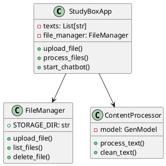

# 📚 Guía para Documentación Académica

## Cómo Presentar el Modelo del Mundo de StudyBox

Esta guía te ayudará a preparar la documentación académica de tu proyecto StudyBox para presentaciones, entregas o defensa de proyecto.

---

## 🎯 Paso 1: Entender el Modelo del Mundo

### ¿Qué es el Modelo del Mundo?

El **modelo del mundo** (o modelo del dominio) es una representación conceptual de:
- Los **objetos** o **entidades** principales de tu sistema
- Las **relaciones** entre estos objetos
- Las **operaciones** que se pueden realizar
- El **comportamiento** del sistema

### En StudyBox, nuestro "mundo" incluye:

1. **Entidades principales:**
   - Archivos/Documentos
   - Contenido procesado
   - Flashcards
   - Quizzes
   - Conversaciones (Chat)
   - Audio
   - Usuario/Estudiante

2. **Relaciones:**
   - Un estudiante **sube** archivos
   - Un archivo **se procesa** en contenido
   - El contenido **genera** flashcards, quizzes, audio
   - El estudiante **interactúa con** las herramientas

3. **Operaciones:**
   - Subir, procesar, eliminar archivos
   - Generar, estudiar, guardar flashcards
   - Crear, responder, calificar quizzes
   - Preguntar, responder en chat
   - Generar, reproducir audio

---

## 📝 Paso 2: Documentos que Necesitas

### Para tu entrega académica, necesitas:

#### 1. **Documento Principal: Modelo del Mundo**
✅ **Ya lo tienes:** `MODELO_DEL_MUNDO.md`

**Incluye:**
- Introducción y contexto
- Conceptos del dominio
- Arquitectura del sistema
- Componentes principales
- Flujo de datos
- Patrones de diseño
- Casos de uso

#### 2. **Diagramas Visuales**
✅ **Ya lo tienes:** `DIAGRAMAS_VISUALES.md`

**Incluye:**
- Diagrama de arquitectura
- Diagramas de secuencia
- Diagrama de estados
- Diagrama de componentes
- Diagrama de flujo
- Diagrama de despliegue
- Diagrama de paquetes
- Diagrama de casos de uso

#### 3. **Documentación de Usuario**
✅ **Ya lo tienes:**
- `README.md` - Documentación general
- `GUIA_GUI.md` - Guía de interfaz gráfica
- `INICIO_RAPIDO.md` - Guía de inicio

---

## 🎨 Paso 3: Crear Presentación Visual

### Opción A: Presentación PowerPoint/Google Slides

#### Estructura Recomendada (15-20 diapositivas):

**1. Portada**
- Título: "StudyBox - Aplicación de Estudio Inteligente"
- Autores: José Manuel Jaramillo, Samuel Romaña, Nicolás Peña
- Fecha y curso

**2. Agenda (1 diapositiva)**
- Problema
- Solución
- Arquitectura
- Modelo de Dominio
- Demostración
- Conclusiones

**3. Problema (2 diapositivas)**
- Slide 1: ¿Qué problema resuelve?
  - Sobrecarga de información
  - Falta de herramientas interactivas
  - Tiempo limitado para estudiar
- Slide 2: Necesidades del estudiante
  - Procesar materiales rápido
  - Generar herramientas de estudio
  - Retroalimentación inmediata

**4. Solución Propuesta (2 diapositivas)**
- Slide 1: ¿Qué es StudyBox?
  - Aplicación multiplataforma
  - Usa IA (Google Gemini)
  - Genera herramientas interactivas
- Slide 2: Funcionalidades principales
  - Procesamiento de archivos
  - Flashcards automáticas
  - Quiz interactivos
  - Chatbot inteligente
  - Generación de audio

**5. Arquitectura del Sistema (3 diapositivas)**
- Slide 1: Vista general de capas
  - Presentación (GUI/CLI)
  - Lógica de negocio
  - Persistencia
  - Servicios externos
- Slide 2: Componentes principales
  - FileManager
  - ContentProcessor
  - Herramientas (Tools)
- Slide 3: Tecnologías utilizadas
  - Python 3.13+
  - Tkinter (GUI)
  - Google Gemini API
  - pyttsx3, pygame, etc.

**6. Modelo de Dominio (4 diapositivas)**
- Slide 1: Entidades principales
  - Archivo, Contenido, Flashcard, Quiz, Audio, Usuario
- Slide 2: Relaciones entre entidades
  - Diagrama de clases simplificado
- Slide 3: Flujo de datos
  - De archivo a herramientas de estudio
- Slide 4: Patrones de diseño
  - Strategy, Facade, Observer

**7. Casos de Uso (2 diapositivas)**
- Slide 1: Flujo principal de estudio
  - Subir → Procesar → Usar herramientas
- Slide 2: Caso de uso detallado
  - Ejemplo: Generar y estudiar con quiz

**8. Demostración (2-3 diapositivas)**
- Screenshots de la aplicación
- Flujo de uso real
- Resultados obtenidos

**9. Logros y Métricas (1 diapositiva)**
- Líneas de código: ~2000+
- Herramientas implementadas: 6
- Formatos soportados: 10+
- Funcionalidad completa en GUI

**10. Conclusiones (1 diapositiva)**
- Objetivos cumplidos
- Aprendizajes
- Trabajo futuro

**11. Preguntas (1 diapositiva)**
- Espacio para Q&A

### Opción B: Video Demostración

**Estructura de Video (5-8 minutos):**

1. **Introducción (30 seg)**
   - Presentación del equipo
   - Título del proyecto

2. **Problema y Solución (1 min)**
   - Explicar el problema
   - Presentar StudyBox como solución

3. **Arquitectura (1-2 min)**
   - Mostrar diagrama de arquitectura
   - Explicar componentes principales
   - Mencionar tecnologías

4. **Demostración en Vivo (3-4 min)**
   - Subir un archivo
   - Procesarlo
   - Generar flashcards
   - Hacer un quiz
   - Usar el chatbot
   - Generar y reproducir audio

5. **Modelo de Dominio (1 min)**
   - Mostrar diagrama de clases
   - Explicar relaciones principales

6. **Conclusiones (30 seg)**
   - Resumen de logros
   - Trabajo futuro

---

## 💻 Paso 4: Preparar Demostración en Vivo

### Checklist Pre-Demostración

#### 1. Configuración del Entorno
- [ ] Python 3.13+ instalado
- [ ] Todas las dependencias instaladas (`pip install -r requirements.txt`)
- [ ] API key de Gemini configurada en `.env`
- [ ] Aplicación probada y funcionando

#### 2. Preparar Datos de Prueba
- [ ] Archivo de texto de ejemplo preparado
- [ ] Contenido relevante y educativo
- [ ] No muy largo (para demo rápida)

**Ejemplo de archivo de prueba (`demo_poo.txt`):**
```
Programación Orientada a Objetos

La POO es un paradigma de programación que organiza el código
en objetos que contienen datos (atributos) y comportamientos (métodos).

Conceptos Clave:
1. Clase: Plantilla para crear objetos
2. Objeto: Instancia de una clase
3. Herencia: Reutilización de código
4. Polimorfismo: Múltiples formas de un método
5. Encapsulamiento: Ocultación de datos

Ejemplo:
class Estudiante:
    def __init__(self, nombre):
        self.nombre = nombre
    
    def estudiar(self):
        print(f"{self.nombre} está estudiando")
```

#### 3. Script de Demostración (5 minutos)

**Minuto 1: Introducción**
- Abrir la aplicación GUI
- Mostrar interfaz limpia y organizada
- Explicar secciones del menú

**Minuto 2: Subir y Procesar**
- Subir archivo `demo_poo.txt`
- Mostrar confirmación
- Procesar archivo
- Explicar que usa IA para limpiar el texto

**Minuto 3: Flashcards**
- Generar flashcards automáticas
- Mostrar las flashcards generadas
- Explicar formato Q&A

**Minuto 4: Quiz Interactivo**
- Generar quiz de opción múltiple (5 preguntas)
- Responder 2-3 preguntas
- Mostrar feedback inmediato
- Mostrar resultados finales

**Minuto 5: Chatbot y Audio**
- Hacer una pregunta al chatbot
- Mostrar respuesta contextual
- Generar audio (resumen narrado)
- Reproducir audio brevemente

---

## 📊 Paso 5: Crear Diagramas Profesionales

### Herramientas Recomendadas

#### 1. **Draw.io / diagrams.net** (GRATIS)
- URL: https://app.diagrams.net/
- Ideal para: Diagramas UML, arquitectura, flujo
- Exporta a: PNG, SVG, PDF

**Cómo usar:**
1. Abre draw.io
2. Selecciona "UML" o "Software"
3. Arrastra componentes
4. Conecta con flechas
5. Exporta como imagen

#### 2. **PlantUML** (GRATIS - Código a Diagrama)
- URL: https://plantuml.com/
- Ideal para: Diagramas de secuencia, clases
- Genera diagramas desde texto

**Ejemplo para Diagrama de Clases:**


#### 3. **Lucidchart** (Freemium)
- URL: https://www.lucidchart.com/
- Ideal para: Presentaciones profesionales
- Plantillas prediseñadas

#### 4. **Miro** (Colaborativo, Freemium)
- URL: https://miro.com/
- Ideal para: Mapas mentales, colaboración
- Pizarra infinita

### Diagramas Esenciales para tu Presentación

**Debes incluir mínimo:**

1. **Diagrama de Arquitectura** (Capas del sistema)
2. **Diagrama de Componentes** (Módulos principales)
3. **Diagrama de Clases** (Entidades y relaciones)
4. **Diagrama de Secuencia** (Al menos 1 flujo importante)
5. **Diagrama de Casos de Uso** (Actor + funcionalidades)

---

## 📖 Paso 6: Escribir el Informe Técnico

### Estructura del Informe (15-25 páginas)

#### 1. Portada
- Título del proyecto
- Autores
- Institución
- Curso/Asignatura
- Fecha

#### 2. Tabla de Contenidos

#### 3. Resumen Ejecutivo (1 página)
- Qué es el proyecto
- Problema que resuelve
- Tecnologías principales
- Resultados obtenidos

#### 4. Introducción (2 páginas)
- Contexto del problema
- Motivación
- Objetivos generales y específicos
- Alcance del proyecto

#### 5. Marco Teórico (3-4 páginas)
- Programación Orientada a Objetos
- Inteligencia Artificial en educación
- Text-to-Speech
- Interfaces gráficas
- Patrones de diseño

#### 6. Análisis y Diseño (5-7 páginas)
- **6.1 Requerimientos Funcionales**
  - Lo que el sistema debe hacer
- **6.2 Requerimientos No Funcionales**
  - Usabilidad, rendimiento, portabilidad
- **6.3 Modelo del Dominio**
  - Conceptos principales
  - Relaciones entre entidades
- **6.4 Arquitectura del Sistema**
  - Patrón arquitectónico (MVC)
  - Capas del sistema
  - Componentes principales
- **6.5 Diseño Detallado**
  - Diagrama de clases
  - Diagramas de secuencia
  - Diseño de base de datos (JSON)

#### 7. Implementación (3-4 páginas)
- **7.1 Tecnologías Utilizadas**
  - Justificación de cada una
- **7.2 Estructura del Proyecto**
  - Organización de archivos
- **7.3 Componentes Implementados**
  - Descripción de cada módulo
- **7.4 Desafíos y Soluciones**
  - Problemas encontrados
  - Cómo se resolvieron

#### 8. Pruebas y Validación (2 páginas)
- **8.1 Pruebas Unitarias**
  - Qué se probó
- **8.2 Pruebas de Integración**
  - Cómo funcionan los componentes juntos
- **8.3 Pruebas de Usuario**
  - Feedback de usuarios reales

#### 9. Resultados y Análisis (2 páginas)
- Funcionalidades implementadas
- Métricas (líneas de código, tiempo de desarrollo)
- Comparación con objetivos iniciales

#### 10. Conclusiones y Trabajo Futuro (1-2 páginas)
- Resumen de logros
- Aprendizajes
- Limitaciones actuales
- Mejoras futuras

#### 11. Referencias
- Bibliografía
- Enlaces a documentación

#### 12. Anexos
- Código fuente relevante
- Manual de usuario
- Capturas de pantalla

---

## 🎓 Paso 7: Preparar la Defensa Oral

### Tips para la Presentación

#### Antes de la Presentación

1. **Ensaya** (al menos 3 veces)
   - Cronometra tu presentación
   - Practica con alguien
   - Grábate para ver qué mejorar

2. **Prepara respaldo**
   - Video grabado por si falla demo en vivo
   - Screenshots de todo
   - Plan B si no hay internet

3. **Conoce tu código**
   - Revisa las partes más importantes
   - Prepara respuestas sobre decisiones técnicas

#### Durante la Presentación

1. **Introducción clara** (30 seg)
   - Preséntate
   - Di el nombre del proyecto
   - Objetivo en una frase

2. **Habla con confianza**
   - Mira al público
   - Habla despacio y claro
   - Usa lenguaje técnico apropiado

3. **Usa la regla 10-20-30**
   - No más de 10 diapositivas clave
   - No más de 20 minutos
   - Fuente mínimo tamaño 30

4. **Demo en vivo**
   - Prepara todo antes
   - Ten un plan B (video)
   - Explica mientras demuestras

5. **Maneja preguntas**
   - Escucha toda la pregunta
   - Si no sabes, sé honesto
   - "Esa es una buena pregunta, en el código..."

#### Preguntas Frecuentes (prepárate para estas)

**Sobre el Proyecto:**
- ¿Por qué eligieron este proyecto?
- ¿Qué problema resuelve?
- ¿Cuál es la innovación?

**Sobre la Arquitectura:**
- ¿Por qué eligieron este patrón arquitectónico?
- ¿Cómo se comunican los componentes?
- ¿Qué patrones de diseño usaron?

**Sobre la Implementación:**
- ¿Por qué Python y no otro lenguaje?
- ¿Por qué Tkinter en lugar de otros frameworks?
- ¿Cómo funciona la integración con Gemini?

**Sobre Decisiones Técnicas:**
- ¿Por qué JSON y no una base de datos?
- ¿Cómo manejan los errores?
- ¿Qué pasa si no hay internet?

**Sobre el Futuro:**
- ¿Qué mejorarían?
- ¿Cómo escalaría el proyecto?
- ¿Qué funcionalidades agregarían?

---

## ✅ Checklist Final

### Documentación Completa

- [ ] `MODELO_DEL_MUNDO.md` revisado
- [ ] `DIAGRAMAS_VISUALES.md` revisado
- [ ] Todos los diagramas generados como imágenes
- [ ] Informe técnico completo
- [ ] Presentación PowerPoint/Slides lista
- [ ] Video de demostración (opcional)

### Código y Proyecto

- [ ] Código comentado y limpio
- [ ] `README.md` actualizado
- [ ] Todas las dependencias en `requirements.txt`
- [ ] `.env.example` con instrucciones
- [ ] Proyecto funciona sin errores

### Presentación

- [ ] Demostración ensayada
- [ ] Archivo de prueba preparado
- [ ] Plan B (video) listo
- [ ] Respuestas a preguntas comunes preparadas
- [ ] Ropa y presentación personal apropiadas

### Logística

- [ ] Laptop cargada
- [ ] Adaptadores y cables
- [ ] Proyecto instalado y probado
- [ ] Conexión a internet verificada (si es necesaria)
- [ ] Presentación en USB/nube de respaldo

---

## 🎯 Ejemplo de Introducción para la Defensa

> "Buenos días/tardes. Somos José Manuel Jaramillo, Samuel Romaña y Nicolás Peña, y el día de hoy presentaremos nuestro proyecto 'StudyBox: Aplicación de Estudio Inteligente'.
>
> StudyBox nace de una necesidad que todos los estudiantes enfrentamos: la sobrecarga de información y la falta de herramientas interactivas para estudiar de manera efectiva.
>
> Nuestro proyecto es una aplicación multiplataforma desarrollada en Python que utiliza Inteligencia Artificial de Google Gemini para procesar materiales de estudio y generar automáticamente herramientas interactivas como flashcards, quizzes, audio narrado y un chatbot inteligente.
>
> En los próximos minutos les mostraremos la arquitectura del sistema, el modelo de dominio, una demostración en vivo de las funcionalidades, y finalmente discutiremos los resultados obtenidos y el trabajo futuro.
>
> Comencemos..."

---

## 📚 Recursos Adicionales

### Documentación de Referencia
- Python Docs: https://docs.python.org/3/
- Tkinter: https://docs.python.org/3/library/tkinter.html
- Google Gemini: https://ai.google.dev/
- UML: https://www.uml.org/

### Tutoriales
- Diagramas UML: https://www.youtube.com/watch?v=UI6lqHOVHic
- Presentaciones técnicas: https://www.youtube.com/watch?v=Hp7Id3Yb9XQ
- Defensa de proyectos: https://www.youtube.com/watch?v=YyOXoLjNWY4

---

## 🏆 Criterios de Evaluación Típicos

Tu proyecto será evaluado probablemente en:

1. **Funcionalidad (30%)**
   - El proyecto funciona correctamente
   - Cumple con los requisitos
   - Maneja errores adecuadamente

2. **Diseño y Arquitectura (25%)**
   - Uso de patrones de diseño
   - Código organizado y modular
   - Arquitectura bien definida

3. **Documentación (20%)**
   - Código comentado
   - Documentación técnica completa
   - Diagramas claros

4. **Presentación (15%)**
   - Claridad en la exposición
   - Dominio del tema
   - Respuestas a preguntas

5. **Innovación y Complejidad (10%)**
   - Uso de tecnologías modernas
   - Solución innovadora
   - Complejidad técnica

---

## 💡 Tips Finales

1. **Sé honesto sobre limitaciones**
   - No finjas que algo funciona si no lo hace
   - Explica por qué no se implementó algo

2. **Destaca lo positivo**
   - Enfoca en lo que SÍ funciona
   - Muestra el valor de tu solución

3. **Muestra pasión**
   - Si te gusta tu proyecto, se nota
   - Transmite entusiasmo

4. **Trabajo en equipo**
   - Menciona contribuciones de cada miembro
   - Muestra colaboración

5. **Aprende de la experiencia**
   - Esta es una oportunidad de aprender
   - No te estreses demasiado

---

**¡Éxito en tu presentación! 🚀**

Has construido un proyecto sólido y completo. Ahora solo falta mostrarlo con confianza.

---

**Documento creado para:** José Manuel Jaramillo, Samuel Romaña, Nicolás Peña  
**Proyecto:** StudyBox  
**Fecha:** Noviembre 2025

